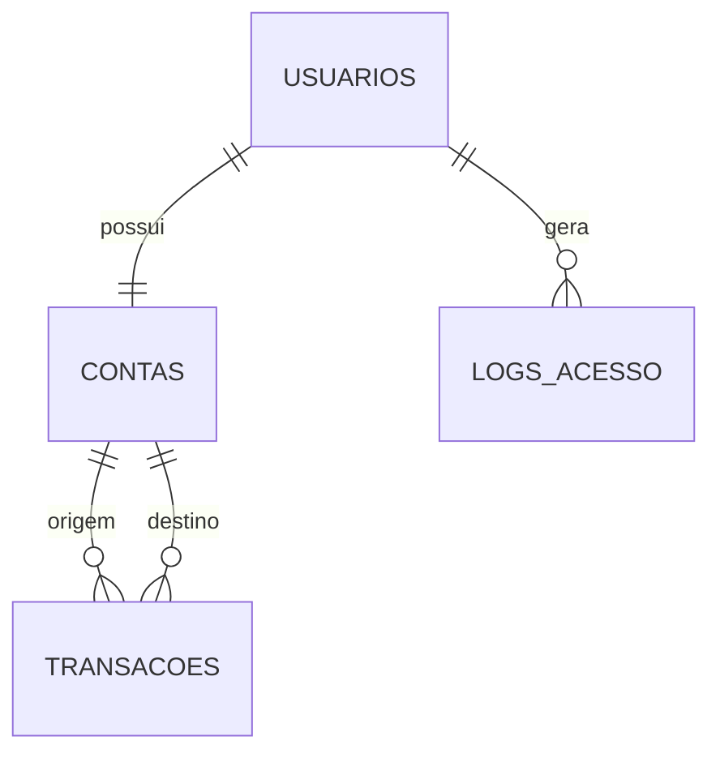

# Requisitos — Carteira Digital

## Escopo e atores

O sistema permite a uma pessoa criar e administrar uma carteira digital, consultar seu saldo e transferir valores para outra pessoa cadastrada. O ator principal é o **usuário autenticado**.

## Requisitos funcionais

| ID | Descrição | Prioridade |
|---|---|---|
| RF-01 | Cadastrar usuário e criar a conta automaticamente | Alta |
| RF-02 | Autenticar usuário por e-mail e senha | Alta |
| RF-03 | Consultar saldo e extrato da própria conta | Alta |
| RF-04 | Transferir valor para usuário identificado pelo e-mail | Alta |
| RF-05 | Editar perfil, senha e cor da carteira | Média |
| RF-06 | Excluir a própria conta | Média |
| RF-07 | Registrar acessos e transações | Média |

## Requisitos não funcionais

| ID | Descrição | Prioridade |
|---|---|---|
| RNF-01 | API REST retorna JSON e códigos HTTP adequados | Alta |
| RNF-02 | Senhas são armazenadas com hash scrypt | Alta |
| RNF-03 | Rotas privadas exigem token assinado | Alta |
| RNF-04 | Layout deve funcionar em telas pequenas e grandes | Média |
| RNF-05 | Dados do banco são protegidos por variáveis de ambiente | Alta |

## Casos de uso

1. Cadastrar-se: visitante informa nome, e-mail e senha; o sistema cria usuário e conta.
2. Entrar: usuário informa credenciais e recebe uma sessão autenticada.
3. Adicionar crédito de demonstração: usuário informa valor positivo e consulta o novo saldo.
4. Transferir: usuário informa e-mail de destino e valor; o sistema valida saldo e registra a transferência.
5. Gerenciar perfil: usuário altera seus dados ou confirma a exclusão da conta.

## Diagrama conceitual

## Dicionário resumido

`usuarios` armazena identidade, e-mail, hash da senha e cor. `contas` armazena o saldo de cada usuário. `transacoes` registra origem, destino, valor, data e status. `logs_acesso` registra data e IP de login.
